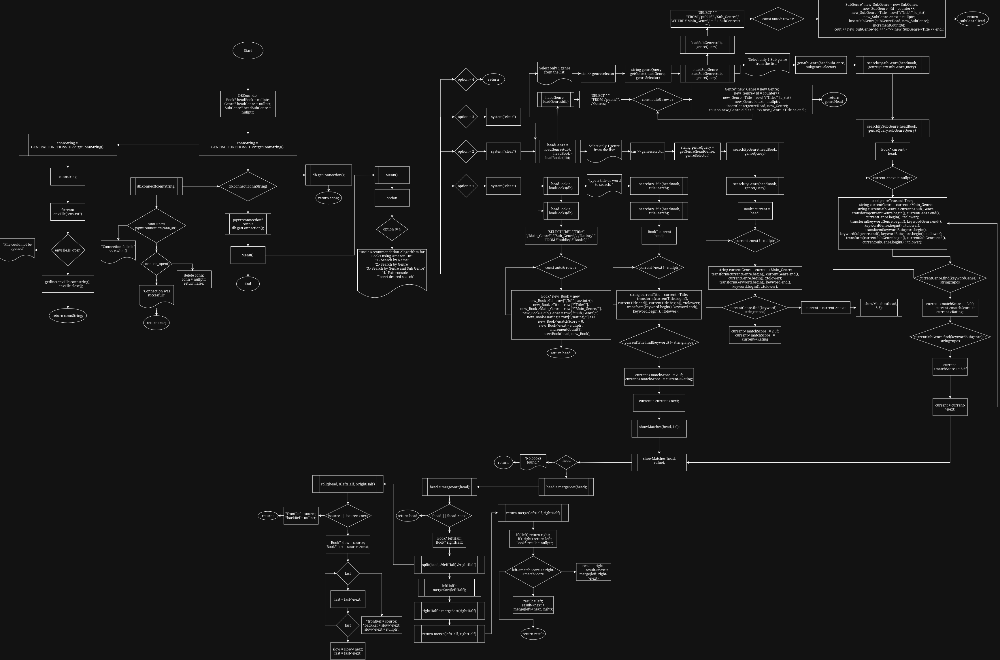

<!-- Improved compatibility of back to top link: See: https://github.com/othneildrew/Best-README-Template/pull/73 -->
<a id="readme-top"></a>
<!--
*** Thanks for checking out the Best-README-Template. If you have a suggestion
*** that would make this better, please fork the repo and create a pull request
*** or simply open an issue with the tag "enhancement".
*** Don't forget to give the project a star!
*** Thanks again! Now go create something AMAZING! :D
-->


<!-- PROJECT SHIELDS -->
<!--
*** I'm using markdown "reference style" links for readability.
*** Reference links are enclosed in brackets [ ] instead of parentheses ( ).
*** See the bottom of this document for the declaration of the reference variables
*** for contributors-url, forks-url, etc. This is an optional, concise syntax you may use.
*** https://www.markdownguide.org/basic-syntax/#reference-style-links
-->
[![Contributors][contributors-shield]][contributors-url]


<!-- PROJECT LOGO -->
<br />
<div align="center">
  <a href="https://github.com/otto-dae/BookRecommendationAlgorithm">
    
  </a>

<h3 align="center">Book Recommendation algorithm</h3>
  <p align="center"> 
    <a href="https://docs.google.com/document/d/1D7pt2AdXyCBtn2zCjjXFxsHSj3dS0GeMhSjjwgvE5-o/edit?usp=sharing"><strong>Explore the documentation »</strong></a>
    <br />
    <br />
  </p>
</div>


<!-- TABLE OF CONTENTS -->
<details>
  <summary>Table of Contents</summary>
  <ol>
    <li>
      <a href="#about-the-project">About The Project</a>
      <ul>
        <li><a href="#built-with">Built With</a></li>
      </ul>
    </li>
    <li>
      <a href="#getting-started">Getting Started</a>
      <ul>
        <li><a href="#get-the-code">Get the code</a></li>
        <li><a href="#compile-and-run">Compile and run</a></li>
      </ul>
    </li>
    <li><a href="#usage">Usage</a></li>
    <li><a href="#diagram">Diagram</a></li>
  </ol>
</details>


<!-- ABOUT THE PROJECT -->
## About The Project

![Product Name Screen Shot][product-screenshot]
This repository is used to save and manage our algorithm and its structure. If you have any questions, please contact the owner (otto-dae).

<p align="right">(<a href="#readme-top">back to top</a>)</p>


### Built With


* ![C++][C++]
* ![Git][Git]
* ![GitHub][GitHub]
* ![VSCode][VSCode]
* ![StackOverFlow][StackOverFlow]


<p align="right">(<a href="#readme-top">back to top</a>)</p>


<!-- GETTING STARTED -->
## Getting Started

### Get the code

To get the project up and running with Git do:
  ```bash
  git clone https://github.com/otto-dae/BookRecommendationAlgorithm.git
  ```

### Compile and run

Using g++ compiler
1. Write in your terminal in the project's directory
   ```sh
    g++ classes/GeneralFunctions/GeneralFunctions.cpp classes/DB/DBConn.cpp classes/DB/DBFunctions.cpp  main.cpp -o main -lpqxx -lpq
   ```
2. Run the compiled code
   ```powershell
   ./main 
   ```

<p align="right">(<a href="#readme-top">back to top</a>)</p>


<!-- USAGE EXAMPLES -->
## Usage

Ana Escrigbe aqui como funciona nuestro codigo. Que no te de miedo, Hi

_For more detail, please refer to the [Documentation](https://docs.google.com/document/d/1D7pt2AdXyCBtn2zCjjXFxsHSj3dS0GeMhSjjwgvE5-o/edit?usp=sharing)_

<p align="right">(<a href="#readme-top">back to top</a>)</p>


<!-- ROADMAP -->
## Diagram

Here goes the diagram made to explain the algorithm

</img>

<p align="right">(<a href="#readme-top">back to top</a>)</p>


<!-- MARKDOWN LINKS & IMAGES -->
<!-- https://www.markdownguide.org/basic-syntax/#reference-style-links -->
[contributors-shield]: https://img.shields.io/github/contributors/otto-dae/BookRecommendationAlgorithm.svg?style=for-the-badge
[contributors-url]: https://github.com/otto-dae/BookRecommendationAlgorithm/graphs/contributors


[C++]: https://img.shields.io/badge/-C++-blue?logo=cplusplus
[GitHub]: https://img.shields.io/badge/GitHub-%23121011.svg?logo=github&logoColor=white
[product-screenshot]: https://art.ngfiles.com/images/2891000/2891329_citrusmillie_the-willow-library-pixel-art-wallpaper.png?f1669689511
[Git]: https://img.shields.io/badge/Git-F05032?logo=git&logoColor=fff
[VSCode]: https://custom-icon-badges.demolab.com/badge/Visual%20Studio%20Code-0078d7.svg?logo=vsc&logoColor=white
[StackOverFlow]: https://img.shields.io/badge/-Stack%20Overflow-FE7A16?logo=stack-overflow&logoColor=white

